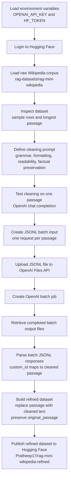
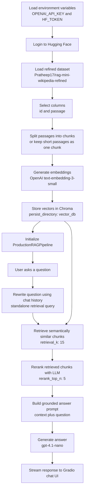

# Data Architecture Diagram: Wikipedia RAG Notebooks

This document explains the data flow across:

- `data_preprocessing.ipynb`
- `rag_pipeline_wiki.ipynb`

Together, these notebooks build a Wikipedia-based RAG system. The first notebook prepares and refines the data. The second notebook embeds that refined data, stores it in a vector database, and exposes a conversational question-answering interface.

## High-Level Architecture

```mermaid
flowchart LR
    A[Hugging Face raw dataset<br/>rag-datasets/rag-mini-wikipedia<br/>config: text-corpus<br/>split: passages]
    B[data_preprocessing.ipynb<br/>Load and inspect raw passages]
    C[OpenAI Batch API<br/>Clean and refine passages<br/>using chat completions]
    D[Refined dataset<br/>id, passage, original_passage]
    E[Hugging Face refined dataset<br/>Pratheep17/rag-mini-wikipedia-refined]
    F[rag_pipeline_wiki.ipynb<br/>Load refined passages]
    G[Chunking<br/>RecursiveCharacterTextSplitter<br/>chunk_size: 1000<br/>chunk_overlap: 150]
    H[OpenAI embeddings<br/>text-embedding-3-small]
    I[Chroma vector database<br/>local folder: vector_db]
    J[User question]
    K[Question rewrite<br/>conversation-aware standalone query]
    L[Semantic retrieval<br/>top 15 chunks]
    M[LLM reranking<br/>gpt-5-mini<br/>top 5 chunks]
    N[Answer generation<br/>gpt-4.1-nano]
    O[Gradio chat UI<br/>Wikipedia Chat Assistant]

    A --> B
    B --> C
    C --> D
    D --> E
    E --> F
    F --> G
    G --> H
    H --> I
    J --> K
    K --> L
    I --> L
    L --> M
    M --> N
    N --> O
```

## Notebook 1: Data Preprocessing Flow

`data_preprocessing.ipynb` is responsible for creating a refined version of the Wikipedia passages.

### Input

| Source | Purpose | Main Fields |
|---|---|---|
| `rag-datasets/rag-mini-wikipedia` | Raw Wikipedia text corpus | `id`, `passage` |

### Processing

| Step | What Happens |
|---|---|
| Environment setup | Loads `OPENAI_API_KEY` and `HF_TOKEN` from `.env`. |
| Dataset loading | Downloads the raw Wikipedia passage dataset from Hugging Face. |
| Data inspection | Prints sample records and finds the longest passage to understand text size. |
| Prompt design | Defines a system prompt that cleans grammar, spacing, punctuation, broken symbols, and formatting while preserving facts. |
| Batch request creation | Converts each passage into an OpenAI Batch API JSONL request. Each line uses the passage `id` as `custom_id`. |
| Batch execution | Uploads the JSONL file and creates a batch job against `/v1/chat/completions`. |
| Batch output parsing | Reads output files from OpenAI, extracts the assistant message content, and builds a `corrected_map`. |
| Dataset reconstruction | Creates a refined dataset with cleaned `passage` and preserved `original_passage`. |
| Publishing | Pushes the refined dataset to Hugging Face as `Pratheep17/rag-mini-wikipedia-refined`. |

### Output

| Output | Description |
|---|---|
| `jsonl/2001_3200.jsonl` | Local batch input file generated for a range of dataset rows. |
| OpenAI batch output files | Batch result files retrieved by file IDs in the notebook. |
| `Pratheep17/rag-mini-wikipedia-refined` | Published refined Hugging Face dataset. |

## Notebook 2: RAG Pipeline Flow

`rag_pipeline_wiki.ipynb` consumes the refined dataset and creates a production-style RAG pipeline.

### Indexing Pipeline

| Step | What Happens |
|---|---|
| Load refined corpus | Loads `Pratheep17/rag-mini-wikipedia-refined` from Hugging Face. |
| Select useful fields | Keeps only `id` and `passage` for indexing. |
| Chunk text | Passages shorter than or equal to 1200 characters stay as one chunk. Longer passages are split with `RecursiveCharacterTextSplitter`. |
| Add metadata | Each chunk stores `source_id`, `chunk_id`, and sometimes `chunk_index`. |
| Embed chunks | Uses OpenAI `text-embedding-3-small` to convert chunk text into vectors. |
| Persist vectors | Stores vectors in a local Chroma collection named `vector_db`. |

### Query-Time Pipeline

| Stage | Component | Purpose |
|---|---|---|
| Stage 0 | Question rewrite | Uses conversation history to turn follow-up questions into standalone retrieval queries. |
| Stage 1 | Retrieval | Embeds the query and retrieves the top matching chunks from Chroma. |
| Stage 2 | Reranking | Uses an LLM to score and reorder retrieved chunks by answer usefulness. |
| Stage 3 | Generation | Builds a grounded prompt from top reranked chunks and generates the final answer. |
| UI | Gradio | Streams answers in a chat interface. |

## Main Data Stores and Artifacts

| Artifact | Location or Name | Created By | Used By | Purpose |
|---|---|---|---|---|
| Raw dataset | `rag-datasets/rag-mini-wikipedia` | External Hugging Face dataset | `data_preprocessing.ipynb` | Original Wikipedia passages. |
| Batch JSONL file | `jsonl/2001_3200.jsonl` | `data_preprocessing.ipynb` | OpenAI Batch API | Input requests for passage refinement. |
| Refined dataset | `Pratheep17/rag-mini-wikipedia-refined` | `data_preprocessing.ipynb` | `rag_pipeline_wiki.ipynb` | Cleaned passages used for RAG. |
| Vector database | `vector_db/` | `rag_pipeline_wiki.ipynb` | `ProductionRAGPipeline` | Persistent semantic search index. |
| Chat application | Gradio `ChatInterface` | `rag_pipeline_wiki.ipynb` | End user | Conversational UI for asking questions. |

## Model Usage

| Area | Model in Notebook | Role |
|---|---|---|
| Passage refinement test | `gpt-5-nano`, `gpt-5.4-nano-2026-03-17` | Cleans raw passages. |
| Batch passage refinement | `gpt-5.4-nano-2026-03-17` | Produces cleaned corpus at scale. |
| Embeddings | `text-embedding-3-small` | Converts chunks and queries into vectors. |
| Answer generation | `gpt-4.1-nano` | Produces final grounded answers. |
| Reranking | `gpt-5-mini` | Reorders retrieved chunks by relevance. |

## End-to-End User Journey

1. A raw Wikipedia passage is loaded from Hugging Face.
2. The passage is cleaned by an OpenAI model through batch processing.
3. The cleaned passage is saved into a refined Hugging Face dataset.
4. The RAG notebook loads the refined dataset.
5. Each passage is chunked and embedded.
6. Embeddings are saved in the local Chroma vector database.
7. A user asks a question in the Gradio chat UI.
8. The pipeline rewrites the question if conversation history is needed.
9. The vector database retrieves relevant chunks.
10. A reranker chooses the most useful chunks.
11. The generator answers using only the selected context.
12. The answer streams back to the user.

## Simple Mental Model

In short:

- `data_preprocessing.ipynb` prepares the knowledge base.
- `rag_pipeline_wiki.ipynb` searches that knowledge base and answers user questions.

